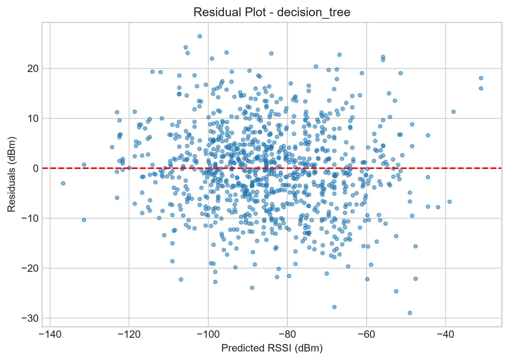
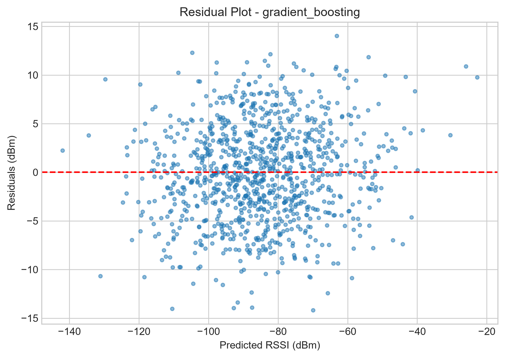
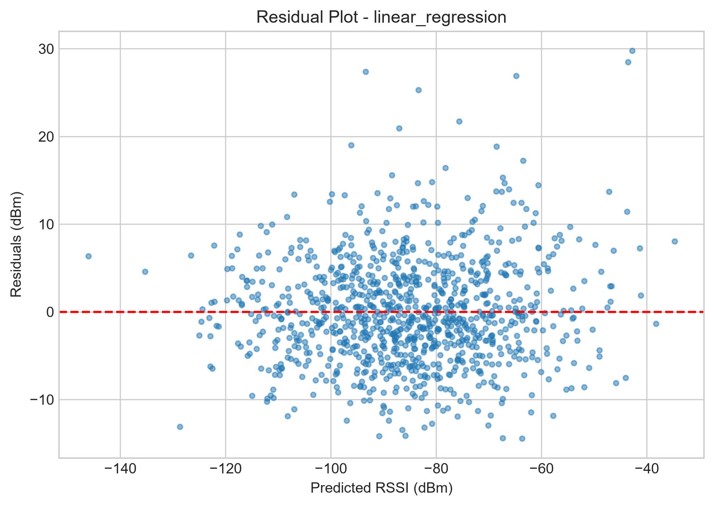
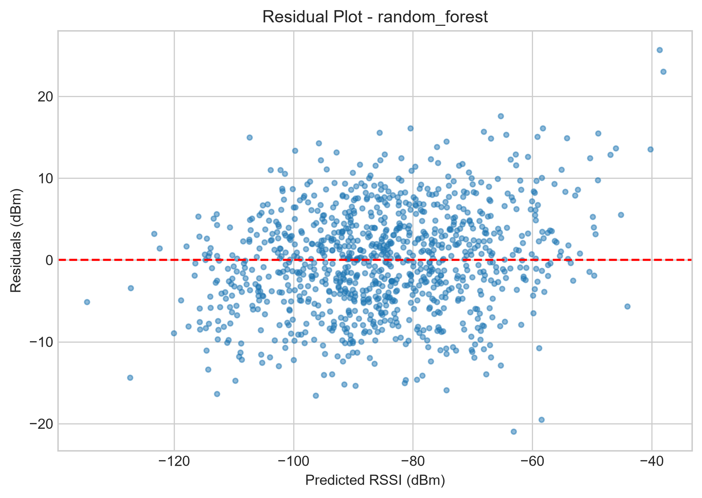

<div align="center">

# 📡 RF Signal Strength Prediction using Machine Learning

### Predicting Received Signal Strength Indicator (RSSI) from Wireless Channel Parameters

[](https://www.python.org/)
[](https://scikit-learn.org/)
[](https://pandas.pydata.org/)
[](https://numpy.org/)
[](https://matplotlib.org/)
[](LICENSE)
[]()

*A complete, modular, end-to-end machine learning pipeline that models RF signal propagation and predicts RSSI (dBm) using classical wireless channel theory combined with modern regression algorithms.*

</div>

---

## 📑 Table of Contents

- [Introduction](#-introduction)
- [Why This Project Matters](#-why-this-project-matters)
- [Architecture](#-architecture)
- [Workflow](#-workflow)
- [Project Structure](#-project-structure)
- [Mathematical Background](#-mathematical-background)
- [Machine Learning Methodology](#-machine-learning-methodology)
- [Installation](#-installation)
- [Usage](#-usage)
- [Results](#-results)
- [Visualizations & Screenshots](#-visualizations--screenshots)
- [Generated Artifacts](#-generated-artifacts)
- [Future Work](#-future-work)
- [Tech Stack](#-tech-stack)
- [Author](#-author)
- [License](#-license)

---

## 🧭 Introduction

Wireless communication systems — from 4G/5G cellular networks to Wi-Fi and IoT deployments — depend heavily on accurately estimating **signal strength (RSSI)** at the receiver to plan coverage, allocate power, and maintain link quality.

This project simulates a realistic RF propagation environment and trains multiple **regression models** to learn the relationship between physical/system parameters and the resulting RSSI (Received Signal Strength Indicator, measured in dBm). It is built as a **portfolio-grade, production-style project** — clean architecture, reproducible experiments, automated reporting, and publication-quality plots — ideal for showcasing skills at the intersection of **Electronics & Communication Engineering** and **Applied Machine Learning**.

**In short: give the model a distance, a frequency, a transmit power, an antenna gain, an obstacle loss, and an environment type — it predicts the signal strength you'd expect to receive.**

---

## 💡 Why This Project Matters

| Domain | Relevance |
|---|---|
| 📶 Telecom & Network Planning | RSSI prediction helps in cell coverage planning, handover optimization, and dead-zone detection |
| 🤖 Machine Learning | Demonstrates a full regression pipeline — from data generation to model selection |
| 🏗️ Software Engineering | Clean, modular, testable, and reproducible codebase following SOLID principles |
| 🎓 ECE Portfolio | Bridges core wireless communication theory (FSPL, path loss) with data-driven modeling |

---

## 🏛️ Architecture

The system follows a **clean, layered architecture** — each module has a single, well-defined responsibility, and layers communicate through simple, well-typed interfaces.

```text
┌──────────────────────────────────────────────────────────────────────┐
│                              main.py                                 │
│                    (Orchestrator / Entry Point)                      │
└───────────────┬───────────────────────────────────┬──────────────────┘
                │                                   │
                ▼                                   ▼
      ┌───────────────────┐                ┌──────────────────┐
      │    config.py       │◄──────────────►│     utils.py     │
      │  paths, features,   │                │ logging, dirs,   │
      │  model settings     │                │ pickle helpers   │
      └─────────┬──────────┘                └──────────────────┘
                │
                ▼
      ┌───────────────────┐
      │    dataset.py       │  → generates / loads synthetic RF dataset
      └─────────┬──────────┘
                ▼
      ┌───────────────────┐
      │  preprocessing.py   │  → scaling + one-hot encoding pipeline
      └─────────┬──────────┘
                ▼
      ┌───────────────────┐        ┌───────────────────┐
      │     model.py        │◄─────►│     train.py       │
      │  regressor factory   │       │ fit, evaluate,     │
      │  & pipeline builder  │       │ persist models     │
      └─────────┬──────────┘        └─────────┬──────────┘
                │                              │
                ▼                              ▼
      ┌───────────────────┐        ┌───────────────────┐
      │  evaluation.py      │       │ visualization.py   │
      │  MAE, MSE, RMSE, R²  │       │  plots & charts    │
      └─────────┬──────────┘        └─────────┬──────────┘
                │                              │
                └───────────────┬──────────────┘
                                ▼
                      ┌───────────────────┐
                      │    predict.py       │  → batch inference
                      │  best-model select   │     from CSV
                      └───────────────────┘
```

**Design principles applied:**
- **Separation of concerns** — data, preprocessing, modeling, evaluation, and visualization never mix responsibilities.
- **Single source of truth** — all paths, feature lists, and hyperparameters live in `config.py`.
- **Reproducibility** — fixed random seeds everywhere (`numpy`, `sklearn` splits, synthetic noise generation).
- **Extensibility** — adding a new model means adding one entry to the model factory in `model.py`.

---

## 🔄 Workflow

```text
   ┌────────────────────┐
   │  Load / Generate     │   5,000-row synthetic RF dataset
   │  RF Dataset          │   (or use a provided CSV)
   └──────────┬───────────┘
              ▼
   ┌────────────────────┐
   │  Preprocess Features  │   scale numeric + one-hot encode
   │                       │   categorical "environment_type"
   └──────────┬───────────┘
              ▼
   ┌────────────────────┐
   │  Train 4 Regressors  │   Linear Regression · Decision Tree
   │                       │   Random Forest · Gradient Boosting
   └──────────┬───────────┘
              ▼
   ┌────────────────────┐
   │  Evaluate Models      │   MAE · MSE · RMSE · R²
   └──────────┬───────────┘
              ▼
   ┌────────────────────┐
   │  Save Models &        │   .pkl pipelines + diagnostic
   │  Visualizations       │   plots (.png)
   └──────────┬───────────┘
              ▼
   ┌────────────────────┐
   │  Select Best Model    │   lowest RMSE wins
   │  (Auto)               │
   └──────────┬───────────┘
              ▼
   ┌────────────────────┐
   │  Batch Predict        │   sample_input.csv → prediction.csv
   └────────────────────┘
```

---

## 📁 Project Structure

```text
rf-signal-strength-prediction-ml/
│
├── main.py                      # End-to-end pipeline entry point
├── train.py                     # Training loop and artifact generation
├── predict.py                   # Batch inference from CSV
├── dataset.py                   # Synthetic RF data + sample input generation
├── preprocessing.py             # Scaling and one-hot encoding pipeline
├── model.py                     # Regressor and pipeline factories
├── evaluation.py                # Regression metrics + report writer
├── visualization.py             # Plot generation helpers
├── config.py                    # Paths, feature lists, model configuration
├── utils.py                     # Logging, directory setup, pickle I/O
│
├── data/
│   ├── rf_dataset.csv           # Generated / provided dataset
│   └── sample_prediction.csv    # Sample batch-inference input
│
├── models/
│   ├── linear_regression.pkl
│   ├── decision_tree.pkl
│   ├── random_forest.pkl
│   └── gradient_boosting.pkl
│
├── outputs/
│   ├── prediction.csv
│   ├── metrics.txt
│   ├── scatter.png
│   ├── correlation_matrix.png
│   ├── heatmap.png
│   ├── model_comparison.png
│   ├── feature_importance.png
│   ├── actual_vs_predicted_<model>.png
│   └── residual_plot_<model>.png
│
├── screenshots/                 # README preview images
├── requirements.txt
├── README.md
├── LICENSE
└── .gitignore
```

> `data/`, `models/`, and `outputs/` are fully reproducible and Git-ignored. Representative images are committed under `screenshots/` purely for documentation.

---

## 📐 Mathematical Background

The synthetic dataset is not random noise — it is generated using the **Free-Space Path Loss (FSPL)** model, a foundational equation in RF and wireless communication engineering, plus environment-specific attenuation and small-scale fading.

**Free-Space Path Loss:**

```text
FSPL (dB) = 32.44 + 20·log10(distance_km) + 20·log10(frequency_MHz)
```

**Resulting Received Signal Strength:**

```text
RSSI (dBm) = Transmit_Power + Antenna_Gain
             − FSPL
             − Obstacle_Loss
             − Environment_Loss
             + Fading_Noise
```

Where:

| Symbol | Meaning | Typical Range |
|---|---|---|
| `distance_km` | Distance between transmitter and receiver | 0.01 – 5 km |
| `frequency_MHz` | Carrier frequency | 700 – 3500 MHz |
| `Transmit_Power` | Power fed to the antenna (dBm) | 20 – 46 dBm |
| `Antenna_Gain` | Combined Tx/Rx antenna gain (dBi) | 0 – 20 dBi |
| `Obstacle_Loss` | Attenuation from physical obstructions (dB) | 0 – 25 dB |
| `Environment_Loss` | Extra loss depending on Urban/Suburban/Rural/Indoor | 0 – 20 dB |
| `Fading_Noise` | Random small-scale fading component (Gaussian) | ~ N(0, σ²) |

This grounding in real RF theory means the models aren't just fitting arbitrary numbers — they are learning an approximation of a physically meaningful, non-linear propagation function, which makes the regression task both realistic and pedagogically valuable.

---

## 🧠 Machine Learning Methodology

1. **Data Generation** — a reproducible, seeded synthetic dataset (5,000 samples) is created using the FSPL-based formula above, with categorical environment types (`Urban`, `Suburban`, `Rural`, `Indoor`) each contributing distinct loss characteristics.
2. **Preprocessing** — numerical features are standardized (`StandardScaler`), and the categorical `environment_type` feature is one-hot encoded — all wrapped in a single `ColumnTransformer` + `Pipeline` for consistency between training and inference.
3. **Model Training** — four complementary regressors are trained on an identical train/test split:
   - **Linear Regression** — a fast, interpretable baseline
   - **Decision Tree Regressor** — captures non-linear thresholds
   - **Random Forest Regressor** — ensemble of trees for variance reduction
   - **Gradient Boosting Regressor** — sequential boosting for high accuracy
4. **Evaluation** — every model is scored on held-out test data using **MAE**, **MSE**, **RMSE**, and **R²**.
5. **Model Selection** — the pipeline automatically selects the model with the **lowest RMSE** as the "best model" for downstream inference.
6. **Batch Inference** — the selected model is applied to a fresh sample input file, and predictions are exported to `outputs/prediction.csv`.
7. **Visualization & Reporting** — diagnostic and result plots are generated automatically for every run, along with a plain-text metrics report.

---

## ⚙️ Installation

```bash
# 1. Clone the repository
git clone https://github.com/ujjwal540/rf-signal-strength-prediction-ml.git
cd rf-signal-strength-prediction-ml

# 2. Create a virtual environment
python -m venv .venv

# 3. Activate it
# Windows PowerShell
.\.venv\Scripts\Activate.ps1
# macOS / Linux
source .venv/bin/activate

# 4. Install dependencies
pip install -r requirements.txt
```

---

## ▶️ Usage

Run the entire pipeline with a single command:

```bash
python main.py
```

This will automatically:
1. Generate (or load) the RF dataset
2. Preprocess features
3. Train all four regressors
4. Evaluate and compare them
5. Persist trained pipelines to `models/`
6. Generate all visualizations to `outputs/`
7. Run batch prediction and save `outputs/prediction.csv`

**Headless / server environments** (no display) should use a non-interactive Matplotlib backend:

```bash
# Windows PowerShell
$env:MPLBACKEND = "Agg"; python main.py

# macOS / Linux
MPLBACKEND=Agg python main.py
```

---

## 📊 Results

The pipeline was executed end-to-end on the generated 5,000-row dataset. **Gradient Boosting** achieved the best performance and was automatically selected as the production model.

| Model | MAE ↓ | MSE ↓ | RMSE ↓ | R² ↑ |
|---|---:|---:|---:|---:|
| Linear Regression | 4.6888 | — | 6.0833 | 0.8840 |
| Decision Tree | 6.8262 | — | 8.7148 | 0.7619 |
| Random Forest | 5.0645 | — | 6.3595 | 0.8732 |
| **Gradient Boosting** 🏆 | **4.0028** | — | **4.9555** | **0.9230** |

**Sample batch predictions** (`outputs/prediction.csv`):

| distance_m | frequency_mhz | environment_type | predicted_rssi_dbm |
|---:|---:|---|---:|
| 4803.33 | 700 | Suburban | -100.25 |
| 1678.45 | 3500 | Rural | -98.39 |
| 3725.45 | 2600 | Indoor | -123.53 |

**Takeaway:** Gradient Boosting's sequential error-correcting ensemble captures the non-linear interplay between distance-driven path loss and categorical environment effects far better than a single tree or a linear baseline — while Random Forest remains a strong, more interpretable runner-up.

---

## 🖼️ Visualizations & Screenshots

### 📈 Model Comparison


**Description:** A side-by-side bar chart comparing RMSE across all four regressors. It immediately highlights that Gradient Boosting produces the tightest prediction error, while the Decision Tree — prone to overfitting on a single split criterion — trails behind the ensemble methods.

---

### 🌡️ Signal-Strength Heatmap


**Description:** A binned heatmap of mean RSSI across distance and frequency ranges. It visually confirms core RF theory: signal strength decays as distance increases and degrades faster at higher frequencies — exactly as predicted by the FSPL equation.

---

### 🎯 Actual vs Predicted RSSI


**Description:** A scatter plot of true RSSI values against the Gradient Boosting model's predictions, with a reference diagonal line. The tight clustering around the diagonal demonstrates strong predictive accuracy and minimal systematic bias.

---

### 📉 Residual Plots

| Decision Tree | Gradient Boosting |
|---|---|
|  |  |

**Description:** Residual plots reveal how prediction errors are distributed. The Decision Tree shows wider, more structured residual spread (a sign of overfitting to training splits), while Gradient Boosting's residuals are tighter and more randomly scattered around zero — indicating a better-calibrated model.

| Linear Regression | Random Forest |
|---|---|
|  |  |

**Description:** Linear Regression's residuals show mild curvature, hinting at the non-linear (logarithmic) nature of path loss that a purely linear model can't fully capture. Random Forest smooths this out considerably through ensemble averaging.

---

## 📦 Generated Artifacts

After running `python main.py`, inspect:

- `models/*.pkl` — trained preprocessing-and-model pipelines, ready for reuse.
- `outputs/metrics.txt` — MAE, MSE, RMSE, and R² for every model.
- `outputs/prediction.csv` — sample input with `predicted_rssi_dbm` appended.
- `outputs/scatter.png` & `outputs/correlation_matrix.png` — exploratory data diagnostics.
- `outputs/heatmap.png`, `outputs/model_comparison.png`, `outputs/feature_importance.png` — summary visualizations.
- `outputs/actual_vs_predicted_<model>.png` & `outputs/residual_plot_<model>.png` — per-model evaluation plots.

---

## 🚀 Future Work

- 🔴 **Real-world RF datasets** — integrate live drive-test / crowd-sourced RSSI measurements alongside the synthetic generator.
- 🌐 **Deep learning models** — experiment with neural networks (MLP, LSTM for spatial-temporal RF traces).
- 📡 **5G / mmWave extensions** — model beamforming gain and higher-frequency, higher-path-loss regimes.
- 🗺️ **Geospatial visualization** — plot predictions on interactive maps (Folium / Plotly) using lat/long coordinates.
- ⚡ **Hyperparameter optimization** — add automated tuning via `GridSearchCV` / `Optuna`.
- 🧪 **Model explainability** — integrate SHAP values for per-prediction feature attribution.
- 🌍 **Web dashboard / API** — expose predictions through a FastAPI service with a live inference dashboard.
- 📦 **CI/CD & testing** — add unit tests (`pytest`) and a GitHub Actions pipeline for automated validation.

---

## 🛠️ Tech Stack

| Category | Tools |
|---|---|
| Language | Python 3.9+ |
| ML Framework | Scikit-learn |
| Data Handling | Pandas, NumPy |
| Visualization | Matplotlib |
| Serialization | Pickle |
| Style & Quality | PEP 8, type hints, docstrings, logging |

---

## 👤 Author

**Ujjwal Kumar Karn**

[](https://github.com/ujjwal540)

If you find this project useful, consider ⭐ starring the repository — it helps others discover it too!

---

## 📄 License

This project is licensed under the [MIT License](LICENSE) — free to use, modify, and distribute with attribution.

<div align="center">

**Made with 📡 + 🤖 by a mind fascinated by signals and systems.**

</div>
