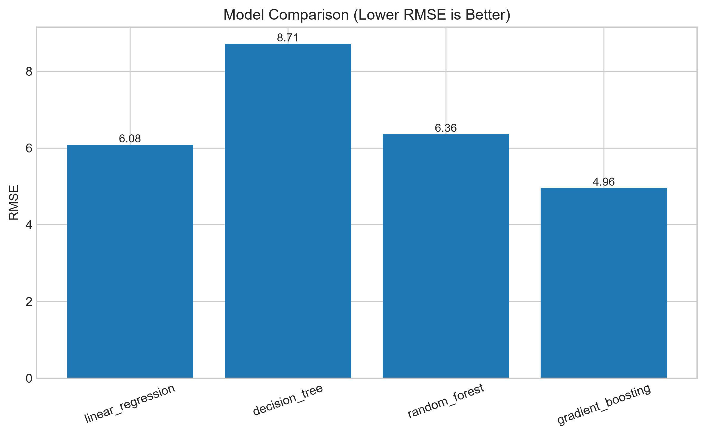
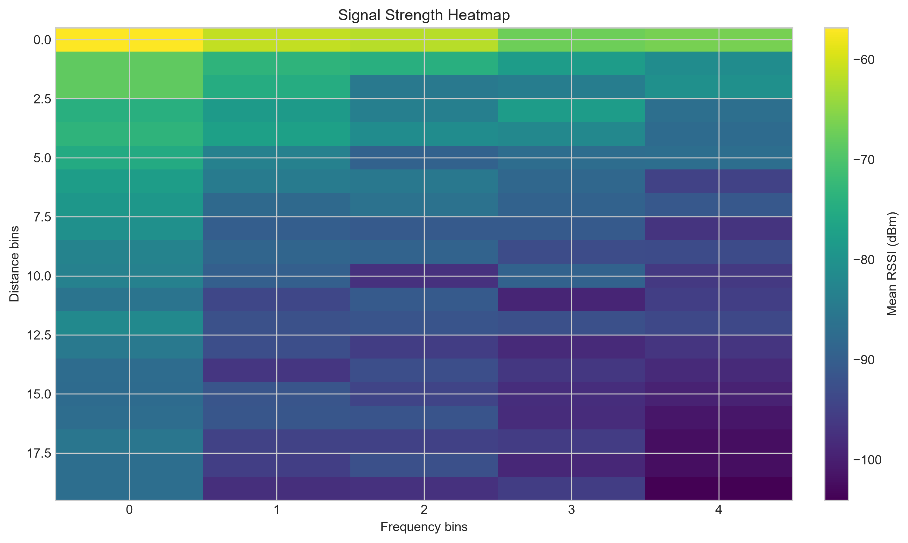
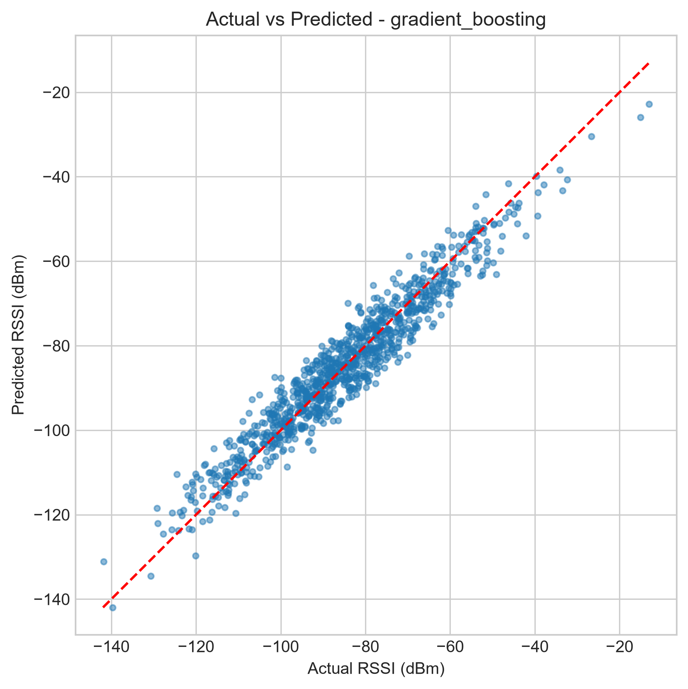

# RF Signal Strength Prediction using Machine Learning

An end-to-end Python machine-learning project for predicting received signal
strength indicator (RSSI, dBm) from wireless-channel and system parameters.
It includes synthetic RF data generation, preprocessing, model training,
evaluation, visualizations, and batch prediction export.

## Features

- Generates a reproducible 5,000-row synthetic RF dataset when one is absent.
- Uses distance, frequency, transmit power, antenna gain, obstacle loss, and
  environment type to predict RSSI.
- Trains Linear Regression, Decision Tree, Random Forest, and Gradient
  Boosting regressors.
- Saves fitted pipelines, model metrics, prediction CSVs, and diagnostic plots.
- Selects the model with the lowest RMSE for sample batch inference.

## Project structure

```text
.
|-- main.py                           # End-to-end pipeline entry point
|-- rf_signal_strength_prediction.py  # Compatibility entry point for main.py
|-- config.py                         # Paths, features, and model configuration
|-- dataset.py                        # Synthetic data and sample-input creation
|-- preprocessing.py                  # Feature split, scaling, and one-hot encoding
|-- model.py                          # Regressor and sklearn pipeline factories
|-- train.py                          # Training, evaluation, artifact generation
|-- evaluation.py                     # Regression metrics and metrics report writer
|-- predict.py                        # Batch inference from CSV
|-- visualization.py                  # Plot generation helpers
|-- utils.py                          # Logging, directory, and pickle helpers
|-- requirements.txt                  # Python dependencies
|-- data/
|   |-- rf_dataset.csv                # Generated synthetic training data
|   `-- sample_prediction.csv         # Generated feature-only inference input
|-- models/                           # Serialized fitted sklearn pipelines (.pkl)
|-- outputs/                          # Metrics, predictions, and generated charts
|-- screenshots/                      # Optional portfolio screenshots
|-- .gitignore
`-- LICENSE
```

`data/`, `models/`, and the generated files in `outputs/` are reproducible
artifacts and are ignored by Git. The supplied copies demonstrate the latest
successful run.

## How it works

```text
Load or generate RF data
        -> preprocess numerical and categorical features
        -> train four regressors
        -> evaluate MAE, MSE, RMSE, and R2
        -> save models and visualizations
        -> choose the lowest-RMSE model
        -> predict the sample input and export prediction.csv
```

The synthetic target is based on free-space path loss (FSPL):

```text
FSPL(dB) = 32.44 + 20 log10(distance_km) + 20 log10(frequency_MHz)
RSSI(dBm) = transmit_power + antenna_gain - FSPL
            - obstacle_loss - environment_loss + fading_noise
```

## Installation

```bash
git clone https://github.com/ujjwal540/rf-signal-strength-prediction-ml.git
cd rf-signal-strength-prediction-ml
python -m venv .venv
```

Activate the environment:

```bash
# Windows PowerShell
.\.venv\Scripts\Activate.ps1

# macOS/Linux
source .venv/bin/activate
```

Install dependencies and run the full pipeline:

```bash
pip install -r requirements.txt
python main.py
```

For headless systems (for example, CI or a server), use a non-interactive
Matplotlib backend:

```bash
# Windows PowerShell
$env:MPLBACKEND = "Agg"; python main.py

# macOS/Linux
MPLBACKEND=Agg python main.py
```

## Verified output

The pipeline was run successfully against the included dataset. Gradient
Boosting was selected as the best model by RMSE.

| Model | MAE | RMSE | R2 |
|---|---:|---:|---:|
| Linear Regression | 4.688803 | 6.083295 | 0.883984 |
| Decision Tree | 6.826181 | 8.714845 | 0.761900 |
| Random Forest | 5.064458 | 6.359464 | 0.873211 |
| Gradient Boosting | **4.002769** | **4.955520** | **0.923013** |

The batch inference step writes 25 rows to `outputs/prediction.csv`. Example
prediction output:

```csv
distance_m,frequency_mhz,environment_type,predicted_rssi_dbm
4803.328943,700,Suburban,-100.247887
1678.452541,3500,Rural,-98.385515
3725.452999,2600,Indoor,-123.534565
```

The full metrics report is available at `outputs/metrics.txt` after a run.

## Screenshots

The following representative screenshots are committed in `screenshots/`. The
same charts are regenerated in `outputs/` whenever the pipeline runs.

### Model comparison



### Signal strength heatmap



### Gradient Boosting: actual vs predicted RSSI



## Generated artifacts

After `python main.py`, inspect:

- `models/*.pkl` - trained preprocessing-and-model pipelines.
- `outputs/metrics.txt` - MAE, MSE, RMSE, and R2 for every model.
- `outputs/prediction.csv` - sample input with `predicted_rssi_dbm` appended.
- `outputs/scatter.png` and `outputs/correlation_matrix.png` - dataset diagnostics.
- `outputs/heatmap.png` - mean RSSI by binned distance and frequency.
- `outputs/model_comparison.png` - RMSE comparison.
- `outputs/actual_vs_predicted_<model>.png` and
  `outputs/residual_plot_<model>.png` - per-model evaluation plots.
- `outputs/feature_importance.png` - selected model feature importance.

## License

This project is licensed under the [MIT License](LICENSE).
